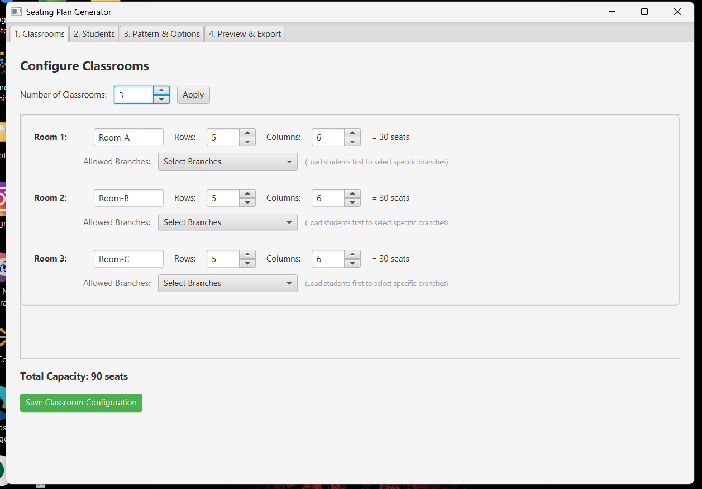
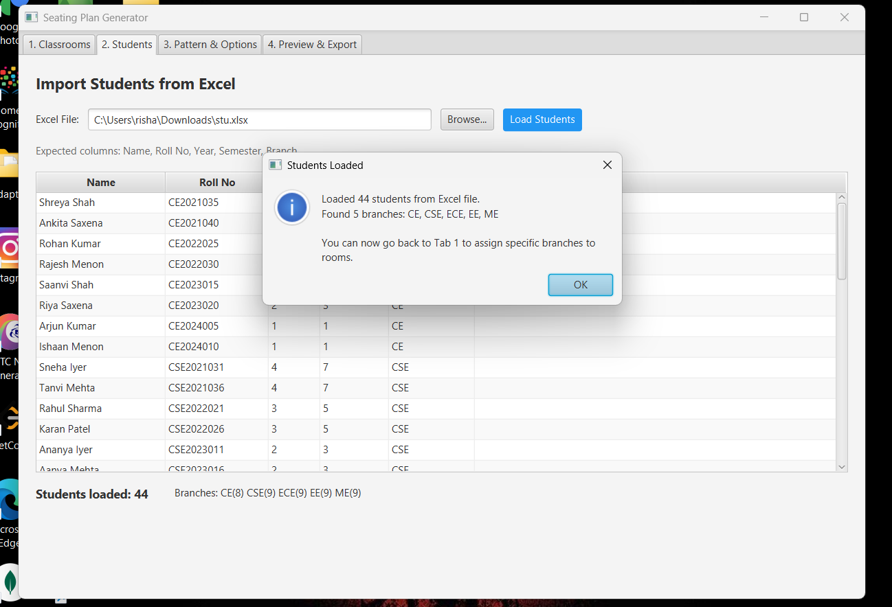
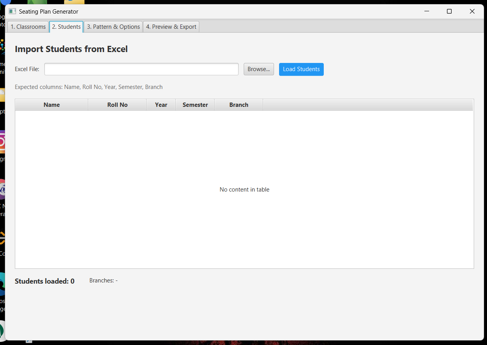
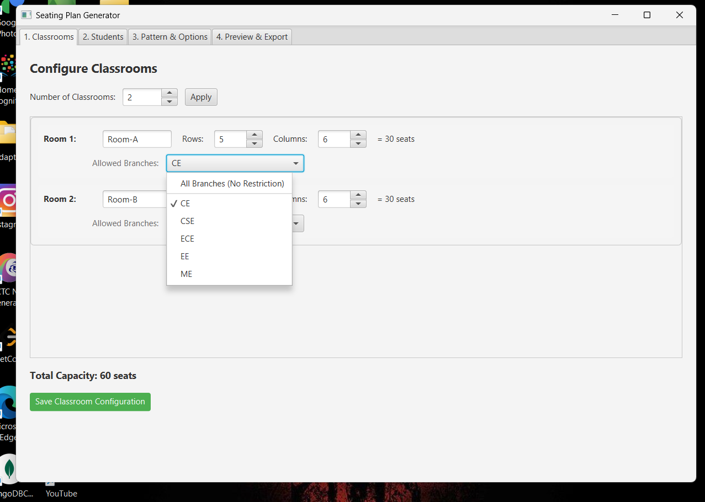
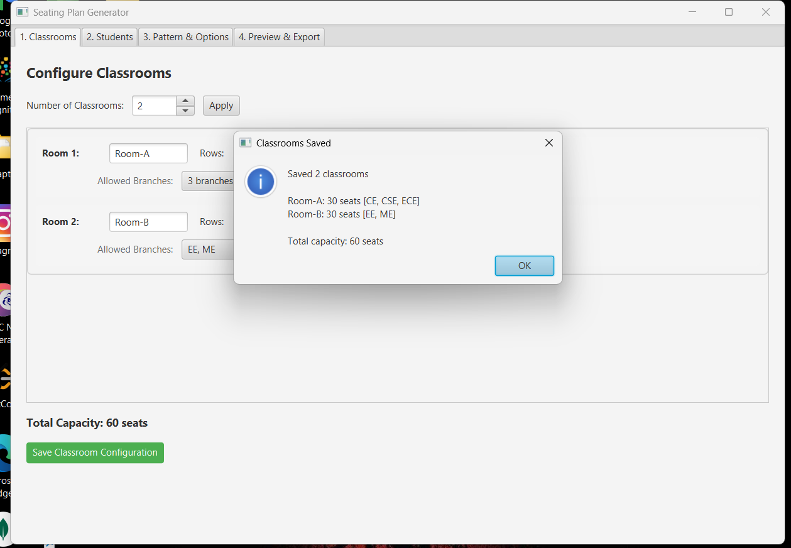
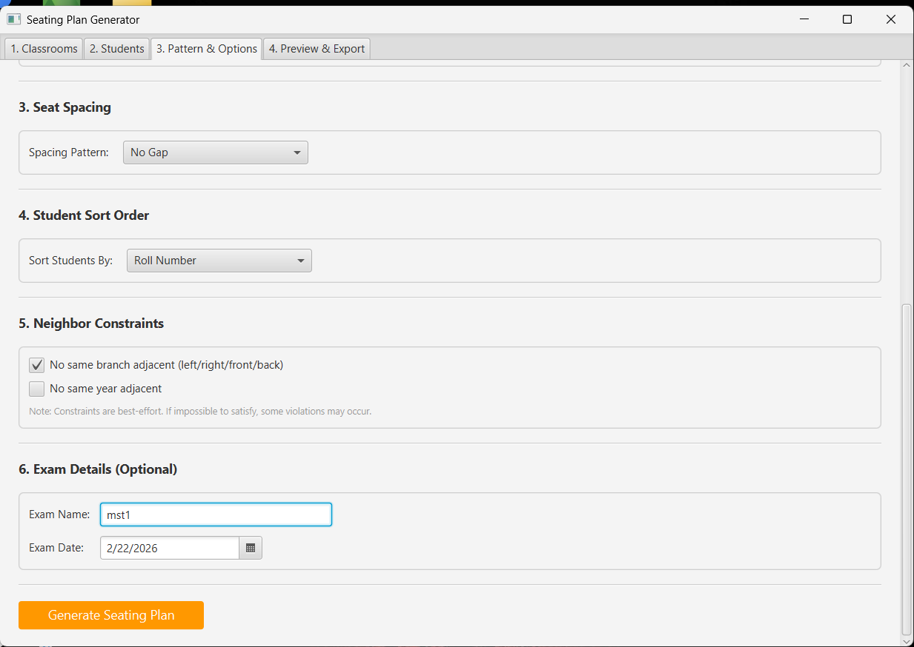
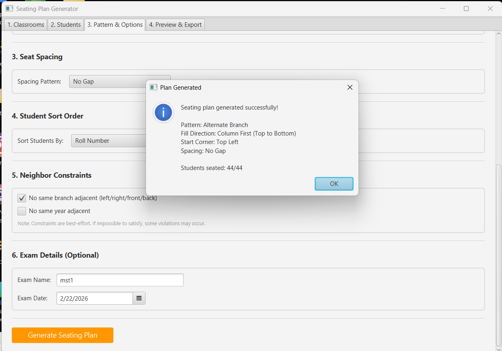
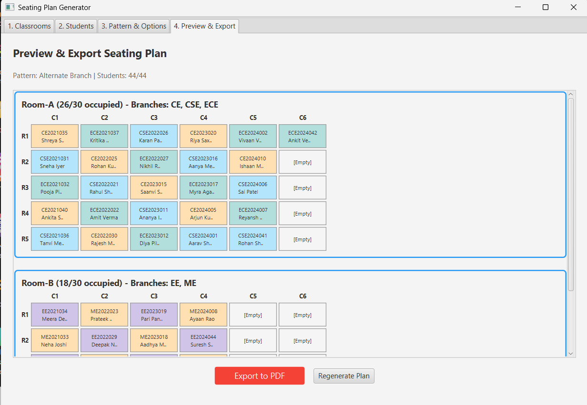
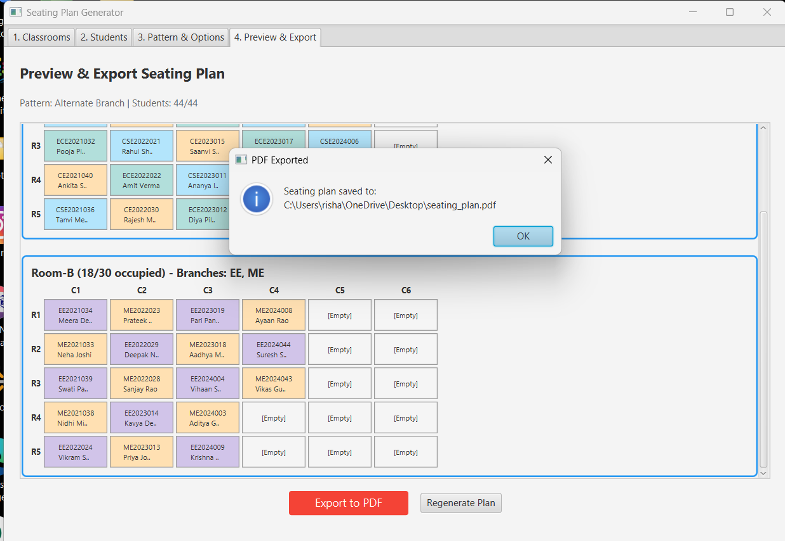

<div align="center">

# 🪑 Exam Seating Plan Generator

### Intelligent Exam Seating Arrangement System


*Generate professional exam seating arrangements with multiple patterns, branch constraints, and PDF export*

[Features](#-features) • [Installation](#-installation) • [Usage](#-usage) • [Screenshots](#-screenshots) • [Download](#-download)

---



</div>

## 📋 Overview

The **Exam Seating Plan Generator** is a comprehensive desktop application designed to automate the tedious process of creating exam seating arrangements. It supports multiple seating patterns, enforces branch/year constraints to prevent cheating, and generates professional PDF output ready for printing.

Perfect for:
- 🏫 **Universities** conducting semester exams
- 🎓 **Colleges** with multiple branches in one room
- 📝 **Competitive exams** requiring randomized seating
- 🏢 **Institutions** needing organized seating plans

---

## ✨ Features

### 📥 Data Import
- Import student data from **Excel (.xlsx)** files
- Automatic detection of columns (Roll No, Name, Branch, Year, Semester)
- Support for large datasets (1000+ students)

### 🏛️ Classroom Management
- Configure **unlimited classrooms** with custom dimensions
- Assign **specific branches** to specific rooms (2-3 branches per room)
- Set maximum students per branch per room

### 🎯 Seating Patterns

| Pattern | Description | Best For |
|---------|-------------|----------|
| **Sequential** | Students arranged in roll number order | Quick assignments |
| **Alternate Branch** | Different branches sit in alternate seats | Preventing copying |
| **Alternate Year/Semester** | Different years sit alternately | Mixed-year exams |
| **Random Shuffle** | Completely randomized arrangement | Maximum security |

### ⚙️ Advanced Customization

<table>
<tr>
<td width="50%">

**🔄 Fill Direction**
- Row First (left → right)
- Column First (top → bottom)  
- Zigzag Row (serpentine)
- Zigzag Column

</td>
<td width="50%">

**📍 Starting Corner**
- Top-Left ↘
- Top-Right ↙
- Bottom-Left ↗
- Bottom-Right ↖

</td>
</tr>
<tr>
<td>

**🪑 Seat Gapping**
- No Gap
- Alternate Seats
- Alternate Rows
- Checkerboard Pattern ♟️

</td>
<td>

**📊 Sorting Options**
- By Roll Number
- By Name
- By Branch
- By Year
- Random Order

</td>
</tr>
</table>

### 📄 PDF Export
- Professional PDF output with room-wise seating charts
- Color-coded branch visualization
- Grid layout with seat positions
- Print-ready format (A4)

---

## 📸 Screenshots

<div align="center">

### 📥 Student Data Import
Load student data from Excel files with automatic column detection



---

### 🏛️ Classroom Configuration
Configure rooms with custom dimensions and branch assignments



---

### ⚙️ Pattern & Options
Choose seating pattern and customize fill direction, gapping, and more



---

### 👁️ Seating Preview
Visual preview with color-coded branches before export






---

### 📄 PDF Output
Professional PDF ready for printing







</div>

---

## 💾 Download

### 🚀 Quick Install (Recommended)
Download the installer and run it - **no Java installation required!**

| Platform | Download | Size |
|----------|----------|------|
| Windows | [**SeatingPlanGenerator-1.0.0.exe**](SeatingPlanGenerator-1.0.0.exe) | ~117 MB |

> **Note:** The installer bundles the Java runtime, so recipients don't need Java installed on their system.

### Installation Steps:
1. Download the `.exe` file
2. Double-click to run installer
3. Follow the setup wizard
4. Launch from Start Menu or Desktop shortcut

---

## 📦 Sample Files

This repository includes sample files to help you get started:

| File | Description |
|------|-------------|
| [**sample_students.csv**](sample_data/sample_students.csv) | Sample CSV template with student data (open in Excel and save as .xlsx) |
| [**seating_plan.pdf**](seating_plan.pdf) | Sample generated PDF output |

### Excel Template Format
The sample file demonstrates the required column structure:

| Roll Number | Name | Branch | Year | Semester |
|-------------|------|--------|------|----------|
| 2024CS001 | John Doe | CSE | 2 | 3 |
| 2024EC001 | Jane Smith | ECE | 2 | 3 |

> **Tip:** Open the CSV in Excel and save as `.xlsx` format before importing into the application.

---

## 🛠️ Build from Source

### Prerequisites
- Java JDK 17+ (JDK 25 recommended)
- JavaFX SDK
- Apache POI library
- Apache PDFBox library

### Setup Steps

1. **Clone the repository**
   ```bash
   git clone https://github.com/Pawani0/seating_plan_generator.git
   cd seating_plan_generator
   ```

2. **Download required libraries** and place in `lib/` folder:
   
   | Library | Download Link | Folder |
   |---------|--------------|--------|
   | JavaFX SDK | [gluonhq.com/products/javafx](https://gluonhq.com/products/javafx/) | `lib/javafx/` |
   | Apache POI | [poi.apache.org](https://poi.apache.org/download.html) | `lib/poi/` |
   | Apache PDFBox | [pdfbox.apache.org](https://pdfbox.apache.org/download.html) | `lib/pdfbox/` |

3. **Compile the project**
   ```bash
   compile.bat
   ```

4. **Run the application**
   ```bash
   run.bat
   ```

---

## 📖 Usage Guide

### Step 1️⃣: Prepare Excel File

Create an Excel file (`.xlsx`) with the following columns:

| Roll Number | Name | Branch | Year | Semester |
|-------------|------|--------|------|----------|
| 2024CS001 | John Doe | CSE | 2 | 3 |
| 2024EC001 | Jane Smith | ECE | 2 | 3 |
| 2023ME001 | Bob Wilson | ME | 3 | 5 |
| 2024CS002 | Alice Brown | CSE | 2 | 3 |

### Step 2️⃣: Import Student Data

1. Launch the application
2. Click **"Load Excel"** button
3. Select your student data file
4. View imported students in the table

### Step 3️⃣: Configure Classrooms

1. Go to **Tab 2: Classrooms**
2. Enter room name (e.g., "Room 101")
3. Set rows and columns
4. Click **"Add Room"**
5. *(Optional)* Assign specific branches to each room

### Step 4️⃣: Select Pattern & Options

1. Go to **Tab 3: Pattern & Options**
2. Choose seating pattern:
   - Sequential
   - Alternate Branch
   - Alternate Year/Semester
   - Random Shuffle
3. Configure advanced options:
   - Fill direction
   - Starting corner
   - Seat gapping
   - Sorting preference

### Step 5️⃣: Generate & Export

1. Click **"Generate Seating Plan"**
2. Preview the visual seating grid
3. Click **"Export to PDF"**
4. Choose save location
5. Print or share the PDF!

---

## 📁 Project Structure

```
seating-plan-generator/
│
├── 📂 src/com/seatingplan/
│   ├── 📄 Main.java              # JavaFX Application entry
│   ├── 📄 Launcher.java          # Non-JavaFX launcher (for jpackage)
│   │
│   ├── 📂 model/                 # Data Models
│   │   ├── 📄 Student.java       # Student entity
│   │   ├── 📄 Classroom.java     # Room configuration
│   │   ├── 📄 SeatingPlan.java   # Seat assignments
│   │   └── 📄 SeatingConfig.java # All customization options
│   │
│   ├── 📂 excel/
│   │   └── 📄 ExcelReader.java   # Excel (.xlsx) import
│   │
│   ├── 📂 service/               # Allocation Algorithms
│   │   ├── 📄 SeatingAllocator.java        # Interface
│   │   ├── 📄 SequentialAllocator.java     # Sequential pattern
│   │   ├── 📄 AlternateBranchAllocator.java    # Branch alternation
│   │   ├── 📄 AlternateYearSemAllocator.java   # Year alternation
│   │   └── 📄 RandomShuffleAllocator.java  # Random with constraints
│   │
│   ├── 📂 pdf/
│   │   └── 📄 PdfGenerator.java  # PDF export with grids
│   │
│   ├── 📂 ui/
│   │   └── 📄 MainWindow.java    # JavaFX GUI (all tabs)
│   │
│   └── 📂 util/
│       └── 📄 SeatTraversal.java # Configurable seat ordering
│
├── 📂 lib/                       # Dependencies (download separately)
│   ├── javafx/
│   ├── poi/
│   └── pdfbox/
│
├── 📂 sample_data/               # Sample files
│   └── sample_students.csv       # Sample student data template
│
├── 📂 images/                    # Screenshots for README
│
├── 📄 SeatingPlanGenerator-1.0.0.exe  # Windows installer (117 MB)
├── 📄 seating_plan.pdf           # Sample generated output
├── 📄 compile.bat                # Build script
├── 📄 run.bat                    # Run script
├── 📄 .gitignore
├── 📄 LICENSE
└── 📄 README.md
```

---

## 🧰 Technologies

| Technology | Version | Purpose |
|------------|---------|---------|
|  | 25 | Core language |
|  | 25 | Desktop GUI |
|  | 5.2.x | Excel reading |
|  | 3.0.x | PDF generation |
|  | JDK 14+ | Native installer |

---

## 🤝 Contributing

Contributions are welcome! Here's how:

1. **Fork** the repository
2. **Create** your feature branch
   ```bash
   git checkout -b feature/AmazingFeature
   ```
3. **Commit** your changes
   ```bash
   git commit -m 'Add some AmazingFeature'
   ```
4. **Push** to the branch
   ```bash
   git push origin feature/AmazingFeature
   ```
5. **Open** a Pull Request

### Ideas for Contribution:
- [ ] Add more seating patterns
- [ ] Support for CSV import
- [ ] Dark mode theme
- [ ] Seat reservation feature
- [ ] Export to Excel
- [ ] Multi-language support

---

## 📜 License

This project is licensed under the **MIT License** - see the [LICENSE](LICENSE) file for details.

```
MIT License

Copyright (c) 2026

Permission is hereby granted, free of charge, to any person obtaining a copy
of this software and associated documentation files...
```

---

## 🙋 FAQ

<details>
<summary><b>Q: Do I need Java installed to run the installer?</b></summary>
<br>
No! The installer bundles the Java runtime. Just download and install.
</details>

<details>
<summary><b>Q: What Excel formats are supported?</b></summary>
<br>
Only <code>.xlsx</code> (Excel 2007+) format is supported. Save older <code>.xls</code> files as <code>.xlsx</code>.
</details>

<details>
<summary><b>Q: Can I assign multiple branches to one room?</b></summary>
<br>
Yes! Click the branch dropdown in the Classrooms tab to select 2-3 branches per room.
</details>

<details>
<summary><b>Q: How does the "Alternate Branch" pattern work?</b></summary>
<br>
It ensures no two adjacent students (left/right/front/back) are from the same branch, minimizing cheating opportunities.
</details>

---

## 👨‍💻 Author

**Rishabh Pawani**

[](https://github.com/Pawani0)
[](https://www.linkedin.com/in/rishabh-pawani-676120284/)

---

<div align="center">

### ⭐ If this project helped you, give it a star!

Made with ❤️ for educational institutions


</div>
